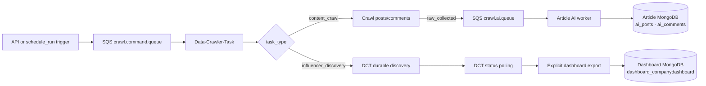

# Social Listening Backend Pipeline

## Introduction

`Backend/` is the Pace-Unit command facade and article-event consumer. It manages typed crawl commands and enriches article/comment events with AI. Data-Crawler-Task owns influencer discovery, evaluation, ranking, durable profile processing, task state, and candidate persistence. The dashboard influencer list is updated only by the explicit DCT export command.

It works with the sibling `Data-Crawler-Task` repository:

- **Article pipeline:** crawl posts/comments → existing `raw_collected` events → AI enrichment → `ai_posts` / `ai_comments`.
- **Influencer pipeline:** publish a complete discovery command → Data-Crawler-Task owns discovery/ranking/state → poll DCT status → run the explicit DCT export command. Influencer results are not response events.

The complete architecture is documented in [../SYSTEM_ARCHITECTURE.md](../SYSTEM_ARCHITECTURE.md).

## Workflow and service ownership



The shared command queue accepts only these task types:

- `content_crawl` → the existing social/content orchestrator.
- `influencer_discovery` → the DCT-owned durable influencer orchestrator.
- Missing `task_type` → legacy content-crawl default.
- Any other value, including `snowball` → rejected.

Run Data-Crawler-Task with one Uvicorn worker. Its startup hook runs the command-SQS consumer. Start the Pace response worker only for content crawls; the new influencer workflow does not publish influencer results to that queue.

## Directory structure

```text
Backend/
├── api/                    # Flask API, including typed crawl requests
├── ai/                     # Article enrichment and ranking logic
├── credentials/            # backend.env and backend_example.env
├── db/                     # Article and dashboard MongoDB clients
├── publishers/             # SQS command publisher
├── tests/                  # Backend unit tests
├── workers/                # Article AI response consumer
├── app.py                  # Flask API entrypoint
└── config.py               # Environment loading and settings

../schedule_run/            # Direct SQS trigger scripts
/Users/sontung/Desktop/3.Project/Robotic Marketer/Data-Crawler-Task/
                            # Local crawler and SQS command consumer
```

## Install the environment

The two repositories use separate virtual environments. Create the Pace-Unit environment in the `Pace-Unit` project directory:

```bash
cd "/Users/sontung/Desktop/3.Project/Robotic Marketer/Pace-Unit"
python3 -m venv .venv
source .venv/bin/activate
pip install -r code/Backend/ai/requirements.txt
pip install -r code/Backend/requirements.txt
```

Create the backend configuration file:

```bash
cp code/Backend/credentials/backend_example.env code/Backend/credentials/backend.env
```

Configure AWS/SQS, article MongoDB, and the DCT status URL in `Backend/credentials/backend.env`. Do not commit it.

Create the DCT environment:

```bash
cd "/Users/sontung/Desktop/3.Project/Robotic Marketer/Data-Crawler-Task"
python3 -m venv .venv
source .venv/bin/activate
pip install -r requirements.txt
playwright install chromium
cp .env.example .env
```

Configure DCT `.env` with `MONGODB_URI`, AWS/SQS values, source API keys, and the optional X session values `X_AUTH_TOKEN` plus `X_CT0` (or `X_BROWSER_SESSION`/`X_SESSION`). The local classifier model is expected at `models/name-classifier`, unless `LOCAL_CLASSIFIER_MODEL` is set.

The dashboard influencer export connection needs:

```env
DASHBOARD_DATABASE_HOST=
DASHBOARD_DATABASE_NAME=
DASHBOARD_DATABASE_USERNAME=
DASHBOARD_DATABASE_PASSWORD=
```

Article/AI data uses `ARTICLE_MONGODB_URI` and `ARTICLE_MONGODB_DBNAME`. `MONGODB_URI` and `MONGODB_DBNAME` remain supported as article-database fallbacks. Dashboard credentials are used by the DCT export process; they are not used by the Pace API.

## Run the complete pipeline

Run each long-lived process in its own terminal.

### 1. Start Data-Crawler-Task API and command consumer

```bash
cd "/Users/sontung/Desktop/3.Project/Robotic Marketer/Data-Crawler-Task"
source .venv/bin/activate
uvicorn app.main:app --host 127.0.0.1 --port 8001 --workers 1
```

Its startup hook starts the command-SQS consumer, which long-polls the queue configured by `AWS_SQS_COMMAND_QUEUE_URL`. Keep `--workers 1`: the DCT process owns shared crawler and X-worker state.

```bash
curl http://127.0.0.1:8001/health
```

### 2. Start the Pace-Unit API

```bash
cd "/Users/sontung/Desktop/3.Project/Robotic Marketer/Pace-Unit/code/Backend"
source ../../.venv/bin/activate
python app.py 8000
```

The API is available at `http://127.0.0.1:8000/api`. It validates and publishes both `content_crawl` and `influencer_discovery` commands.

### 3. Start the Pace article response worker (content only)

```bash
cd "/Users/sontung/Desktop/3.Project/Robotic Marketer/Pace-Unit/code/Backend"
source ../../.venv/bin/activate
AI_QUEUE_BACKEND=sqs python -m workers
```

This worker consumes the article response queue:

- `raw_collected` → AI enrichment → article MongoDB.
- No influencer event is produced by the new crawler workflow, so this worker is not required for influencer jobs.

## API endpoints

| Endpoint | Purpose |
|---|---|
| `GET http://127.0.0.1:8001/health` | DCT liveness check |
| `GET http://127.0.0.1:8001/sources` | DCT content adapter map |
| `POST http://127.0.0.1:8001/crawl` | DCT direct content crawl only |
| `GET http://127.0.0.1:8001/crawl/{task_id}` | DCT-authoritative status |
| `GET http://127.0.0.1:8000/api/health/` | Pace API liveness check |
| `POST http://127.0.0.1:8000/api/crawl/` | Recommended entry point for both pipelines |
| `GET http://127.0.0.1:8000/api/crawl/{job_id}/` | Pace status; proxies influencer status to DCT |

Use Pace's `POST /api/crawl/` for the integrated application flow. DCT's `POST /crawl` is the direct content endpoint and does not start influencer discovery.

## Run a social/content crawl

### Through the Pace API

```bash
curl -X POST http://127.0.0.1:8000/api/crawl/ \
  -H 'Content-Type: application/json' \
  -d '{
    "task_type": "content_crawl",
    "input": {
      "query": "Digital Marketing Trends",
      "source": "all",
      "time_delta": "week",
      "limit": 20
    }
  }'
```

Poll the returned `job_id`:

```bash
curl http://127.0.0.1:8000/api/crawl/<job_id>/
```

The content path remains unchanged: DCT writes `raw_posts`/`raw_comments` and publishes `raw_collected` post/comment events; the Pace article worker consumes those events.

### Through the schedule script

```bash
cd "/Users/sontung/Desktop/3.Project/Robotic Marketer/Pace-Unit/code"
source ../.venv/bin/activate
python schedule_run/trigger_article_pipeline.py \
  --query "Digital Marketing Trends" \
  --source all \
  --time-delta week \
  --limit 20
```

The schedule scripts publish directly to SQS and do not create a Pace `crawl_jobs` record. Use the printed task ID with DCT's direct status endpoint when using this path.

## Run influencer discovery

### Recommended: Pace API → command SQS → DCT

The request must contain the complete company/topic contract. `field` is included as the first discovery term together with `related_terms`.

```bash
curl -X POST http://127.0.0.1:8000/api/crawl/ \
  -H 'Content-Type: application/json' \
  -d '{
    "task_type": "influencer_discovery",
    "input": {
      "company_id": "company-123",
      "company_name": "Marketing Eye",
      "company_domain": "marketingeye.com.au",
      "company_summary": "A marketing agency helping brands grow.",
      "field": "Marketing",
      "related_terms": ["SEO", "content marketing"],
      "platform": "x",
      "limit": 20
    }
  }'
```

Poll the returned `job_id`:

```bash
curl http://127.0.0.1:8000/api/crawl/<job_id>/
```

For influencer jobs, DCT is authoritative. The response includes status, warnings/errors, and progress counters. The normal sequence is `accepted` → `validating` → `discovering` → `processing` → `completed` or `completed_with_no_results`.

The workflow uses the durable X profile queue, one sequential X browser worker, configuration-driven X limits, public-search fallback, evaluation, freshness-aware candidates, and the run-scoped evidence ledger. It does not publish `influencer_list_collected` or any other influencer result event to the Pace article response queue.

### Through the influencer schedule script

```bash
cd "/Users/sontung/Desktop/3.Project/Robotic Marketer/Pace-Unit/code"
source ../.venv/bin/activate
python schedule_run/trigger_influencer_pipeline.py \
  --field "Marketing" \
  --company-id company-123 \
  --company-name "Marketing Eye" \
  --company-domain marketingeye.com.au \
  --company-summary "A marketing agency helping brands grow." \
  --related-terms "SEO,content marketing" \
  --platform x \
  --limit 20 \
  --job-id influencers-marketing-001
```

This is a direct SQS trigger. It does not create a Pace `crawl_jobs` record, so poll DCT directly:

```bash
curl http://127.0.0.1:8001/crawl/influencers-marketing-001
```

The same ID is used as the DCT task ID. Use `--resume` with the same `--job-id` after a resumable DCT stop.

## Run snowball expansion

Snowball has two supported forms.

### Option A: include snowball in normal discovery

Set this in the DCT `.env` and restart DCT before submitting a new `influencer_discovery` command:

```env
ENABLE_SNOWBALL=true
FOLLOWING_MAX_SCROLLS=8
```

The normal discovery task then performs the configured one-hop following expansion as part of the durable workflow. There is no additional Pace API field or SQS `task_type` for this option.

### Option B: run the standalone DCT snowball command

Use this when eligible candidates already exist in `influencer_candidates` and you want an explicit one-hop expansion. Include the field as the first related term so the standalone run uses the same topic context:

```bash
cd "/Users/sontung/Desktop/3.Project/Robotic Marketer/Data-Crawler-Task"
source .venv/bin/activate
python -m x_influencer_discovery snowball \
  --company-id company-123 \
  --company-name "Marketing Eye" \
  --company-domain marketingeye.com.au \
  --company-summary "A marketing agency helping brands grow." \
  --related-terms "Marketing,SEO,content marketing" \
  --platform x \
  --limit 20 \
  --minimum-seed-score 60 \
  --seed-limit 10 \
  --output /tmp/marketing-eye-snowball.json \
  --progress-file /tmp/marketing-eye-snowball.progress.json
```

Do not send `task_type: snowball` to the command queue; the current consumer accepts only `content_crawl` and `influencer_discovery`. The standalone command shares the X worker lock and durable queue, so do not run it concurrently with another X influencer task. If it stops after saving its checkpoint, repeat the command with the same output/progress paths and add `--resume`.

## Export influencers to the dashboard

Export is deliberately separate from discovery and is not automatic. Run it only after discovery or snowball has completed and fresh candidates exist.

The export reads the DCT `influencer_candidates` leaderboard by `company_id` and `platform`, applies `LEADERBOARD_MAX_AGE_DAYS`, maps the dashboard row contract, preserves existing `status`/`relevancy` flags, and refuses empty or invalid results.

First validate without changing the dashboard:

```bash
cd "/Users/sontung/Desktop/3.Project/Robotic Marketer/Data-Crawler-Task"
source .venv/bin/activate
python -m x_influencer_discovery export \
  --company-id company-123 \
  --company-domain marketingeye.com.au \
  --platform x \
  --limit 20 \
  --output /tmp/marketing-eye-export.json \
  --dry-run
```

If the dry run reports the expected handles and rows, run the same command without `--dry-run` to replace that company's dashboard influencer list:

```bash
python -m x_influencer_discovery export \
  --company-id company-123 \
  --company-domain marketingeye.com.au \
  --platform x \
  --limit 20 \
  --output /tmp/marketing-eye-export.json
```

The export requires `MONGODB_URL` for the DCT candidate database and `DASHBOARD_DATABASE_HOST`, `DASHBOARD_DATABASE_NAME`, and—when required by the remote dashboard host—username/password settings for the dashboard database. It writes the audit payload to the required `--output` JSON file.

## Event contracts

| Pipeline | Command | Response |
|---|---|---|
| Article | `task_type: content_crawl` with `query`, `source`, `time_delta`, `limit` | `event_type: raw_collected`, `content_type: post` or `comment` |
| Influencer | `task_type: influencer_discovery` with company identity, `field`, `related_terms`, `platform`, `limit` | No response event; poll DCT `GET /crawl/{task_id}` and use explicit export |

For influencer export, matching handles retain the existing dashboard `status` and `relevancy`. New handles default to `uncontacted` and an empty relevancy value.

The command consumer routes by `task_type`; it does not infer the workflow from the payload:

- `content_crawl` → existing social/content orchestrator.
- `influencer_discovery` → DCT durable influencer orchestrator.
- Missing `task_type` → content-crawl default for backward compatibility.
- Any other value, including `snowball` → rejected.

Only the content path publishes `raw_collected` events to the Pace AI queue. Influencer results are read from DCT status/MongoDB and delivered to the dashboard through the explicit export command.

## Data locations

DCT uses these collections for the new workflow:

- `raw_posts` and `raw_comments`: social/content crawl data.
- `crawl_tasks`: task state for both command types.
- `influencer_candidates`: shared, freshness-aware influencer leaderboard.
- `influencer_candidate_evidence`: run-scoped discovery evidence.

The legacy `influencers` and `x_influencer_runs` collections are retained for rollback/reference and are not written by the new influencer workflow.

## Test

Backend tests:

```bash
cd /Users/sontung/Desktop/3.Project/Robotic\ Marketer/Pace-Unit/code/Backend
source ../../.venv/bin/activate
python -m unittest discover -s tests -p 'test_*.py' -v
```

Crawler tests:

```bash
cd /Users/sontung/Desktop/3.Project/Robotic\ Marketer/Data-Crawler-Task
source .venv/bin/activate
python -m unittest discover -s tests -p 'test_*.py' -v
```

## Troubleshooting

- **Pace accepts a job but DCT does nothing:** verify both services use the same `SQS_COMMAND_QUEUE_URL`/`AWS_SQS_COMMAND_QUEUE_URL`, AWS region/credentials, and that `SQS_COMMAND_CONSUMER_ENABLED=1` is set in DCT.
- **Influencer status is unavailable:** verify `DCT_API_BASE_URL` in Pace and check `curl http://127.0.0.1:8001/health`.
- **Content data is present but AI results are missing:** start `AI_QUEUE_BACKEND=sqs python -m workers` and verify `SQS_AI_QUEUE_URL` matches DCT's `AWS_SQS_QUEUE_URL`.
- **No X candidates:** refresh `X_AUTH_TOKEN`/`X_CT0` or `X_BROWSER_SESSION`; public discovery may still be available but the X lane will be degraded.
- **Classifier/model failure:** verify `LOCAL_CLASSIFIER_MODEL` points to a complete model directory, or configure the supported alternative classification backend.
- **Worker lock or pending queue failure:** only one X worker may run at a time. Wait for the active run to finish, then resume the same task/command as instructed by its status.
- **Export refuses to run:** check `company_id`, `company_domain`, dashboard MongoDB settings, and `LEADERBOARD_MAX_AGE_DAYS`; export intentionally refuses stale, empty, or invalid dashboard payloads.
- **Port conflict:** use crawler port `8001` and Pace API port `8000` as shown above.
