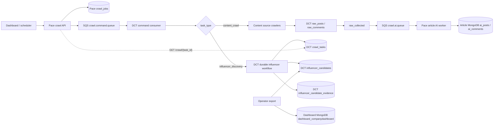

# High-Level System Architecture

> Source of truth for the typed crawl contracts, queue boundaries, task ownership, and influencer data flow.

## Overview

Pace-Unit accepts typed crawl requests and publishes them to the shared command queue. Data-Crawler-Task (DCT) owns crawl execution. Article crawling publishes the existing `raw_collected` events to Pace-Unit for AI enrichment; influencer discovery is self-contained in DCT and never publishes influencer results to the response queue.

| Pipeline | Command | Runtime owner | Result destination |
|---|---|---|---|
| Articles/comments | `task_type=content_crawl` | DCT → Pace response worker | Article MongoDB: `ai_posts`, `ai_comments` |
| Influencers | `task_type=influencer_discovery` | DCT end to end | DCT MongoDB: `influencer_candidates`; explicit export to dashboard MongoDB |

## System flow



## Command contracts

Pace publishes an envelope with `job_id`, `task_type`, and `input`. The influencer request is complete; topic-only requests are rejected.

```json
{
  "job_id": "influencers-marketing-001",
  "task_type": "influencer_discovery",
  "input": {
    "company_id": "company-123",
    "company_name": "Marketing Eye",
    "company_domain": "marketingeye.com.au",
    "company_summary": "A marketing agency helping brands grow.",
    "field": "Marketing",
    "related_terms": ["SEO", "content marketing"],
    "platform": "x",
    "limit": 20
  }
}
```

The same `job_id` is used as the DCT `task_id`. DCT validates and stores the normalized request in `crawl_tasks.params`.

## Influencer workflow

1. Normalize the request into an in-memory `TopicBrief`. It stores `field`, deduplicated `related_terms`, and language; it is not a separate Mongo collection. Discovery receives `[field, ...related_terms]` with the field first.
2. Run X post discovery for every normalized term. Authors-per-query and max-scrolls-per-query come from configuration. The current X query retains `min_faves:200`.
3. Run the public-search lane with the existing rotated templates and per-article candidate setting. No undocumented global candidate cap is applied.
4. Persist source evidence before submitting profile work to the shared durable profile queue.
5. Drain the queue with one sequential authenticated X browser worker, FIFO account grouping, bounded retries, DLQ handling, resume support, and an exclusive worker lock.
6. Evaluate profiles using requester-company matching, company classification, follower minimum, current-year activity, relevance threshold, and the existing unknown-classification fallback. Eligible records use the current scoring model.
7. Upsert eligible current-state records into `influencer_candidates`, keyed by `company_id + platform + account.account_id`. The evidence ledger is keyed by `task_id + company_id + platform + account_id` so queue retry/resume does not lose discovery context.

## Task states and status

Influencer task states are:

```text
accepted → validating → discovering → processing → completed
                                                   ↘ completed_with_no_results
                                                   ↘ failed
                                                   ↘ stopped_x_rate_limit
                                                   ↘ stopped_x_access_errors
```

`GET /crawl/{task_id}` on DCT is authoritative. Progress includes `discovery_submitted`, `profiles_fetched`, `candidates_evaluated`, `eligible`, `rejected`, `retried`, `persisted`, and `dead_lettered`. Lock failures and unfinished queue work fail the task with an actionable reason.

## Explicit dashboard export

Export is operator initiated and never runs inside the discovery worker:

```text
DCT task completed
  → read fresh top N from influencer_candidates by company_id + platform
  → enforce LEADERBOARD_MAX_AGE_DAYS and non-empty company_domain
  → map dashboard fields and preserve existing status/relevancy flags
  → replace dashboard_companydashboard.influencers.0.data.influencers
```

`python -m x_influencer_discovery export ... --dry-run` performs the read/mapping/validation and writes no dashboard update. Empty or stale source results are rejected without changing the dashboard list.

## Data and queue boundaries

| Owner | Collections / queues | Responsibility |
|---|---|---|
| DCT | `raw_posts`, `raw_comments`, `crawl_tasks` | Content crawl state and raw content |
| DCT | `influencer_candidates`, `influencer_candidate_evidence` | Influencer discovery, evaluation, durable current state, evidence, and task progress |
| DCT → Pace | SQS `crawl.ai.queue` | Article response events only |
| Pace | `crawl_jobs` | API job record and DCT task ID facade |
| Pace | Article MongoDB | Article AI persistence |
| DCT export | Dashboard MongoDB `dashboard_companydashboard` | Explicit replacement of the dashboard influencer array |

Legacy `influencers` and `x_influencer_runs` collections are retained for rollback/reference only and are not written by the new runtime. The old `influencer_list_collected` response path is retired.
