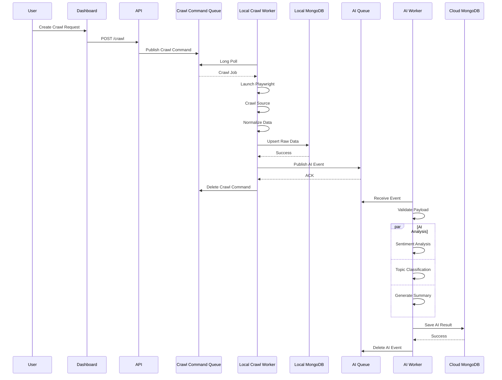

# High-Level System Architecture

> **Source of truth** for system design. All implementation tasks must follow this architecture and sequence strictly. Do not introduce alternate flows, queues, or data stores that conflict with this document. If the design must change, ask the project owner for confirmation first; only after explicit acceptance may this file be updated.

---

## Overview

The system is split across three parts (two deployment environments):

| Part | Role | Repo / deploy |
|---|---|---|
| **AWS EC2** | Web dashboard, crawl management API, job store, and crawl command queue | `Pace-Unit` (this repo) → single EC2 |
| **Local Crawling Environment** | Long-polling crawl worker, source crawlers, normalize + local raw MongoDB, AI event publisher | `Data-Crawler-Task` (sibling repo; stays local) |
| **AWS EC2** | AI queue/worker pool, NLP processing, cloud MongoDB, analytics dashboard, DLQ | Same `Pace-Unit` EC2 deployment |

Cross-environment links:

- Crawl Management API → SQS `crawl.command.queue` → Local Crawl Worker (long poll)
- Local AI Event Publisher → SQS `crawl.ai.queue` → AI Worker Pool

---

## 1. High-Level System Architecture

```mermaid
flowchart LR

%% ==========================
%% AWS EC2
%% ==========================

subgraph AWS["☁️ AWS EC2"]

    WEB["Web Dashboard"]
    API["Crawl Management API"]
    JOBS[("crawl_jobs")]
    CMDQ["SQS<br/>crawl.command.queue"]

    WEB --> API
    API --> JOBS
    API --> CMDQ

end

%% ==========================
%% LOCAL ENVIRONMENT
%% ==========================

subgraph LOCAL["💻 Local Crawling Environment"]

    WORKER["Local Crawl Worker"]

    SCHED["Crawl Scheduler"]

    subgraph SOURCES["Source Crawlers"]

        REDDIT["Reddit"]
        RSS["RSS"]
        NEWS["News APIs"]
        X["X / Twitter"]
        YT["YouTube"]

    end

    FETCH["Playwright / API Fetcher"]

    NORMALIZE["Normalize Data"]

    RAWDB[("Local MongoDB<br/>raw_posts<br/>raw_comments")]

    PUBLISH["AI Event Publisher"]

    WORKER --> SCHED

    SCHED --> REDDIT
    SCHED --> RSS
    SCHED --> NEWS
    SCHED --> X
    SCHED --> YT

    REDDIT --> FETCH
    RSS --> FETCH
    NEWS --> FETCH
    X --> FETCH
    YT --> FETCH

    FETCH --> NORMALIZE

    NORMALIZE --> RAWDB

    RAWDB -->|After successful upsert| PUBLISH

end

%% ==========================
%% AWS EC2
%% ==========================

subgraph AI["☁️ AWS EC2"]

    AIQ["SQS<br/>crawl.ai.queue"]

    AIWORKER["AI Worker Pool"]

    PROCESS["AI Processing<br/><br/>• Sentiment Analysis<br/>• Topic Classification<br/>• Summarization<br/>• Keyword Extraction<br/>• Ranking"]

    CLOUDDB[("Cloud MongoDB<br/>ai_posts<br/>ai_comments")]

    QUERY["Query Database"]

    DASH["Analytics Dashboard"]

    DLQ["SQS DLQ"]

    AIQ --> AIWORKER

    AIWORKER --> PROCESS

    PROCESS --> CLOUDDB

    CLOUDDB --> QUERY

    QUERY --> DASH

    AIWORKER -. Failure .-> DLQ

end

%% ==========================
%% CROSS ENVIRONMENT
%% ==========================

CMDQ -- Long Poll --> WORKER

PUBLISH --> AIQ
```

### Component responsibilities

#### AWS EC2 (Dashboard / API / Commands)

| Component | Responsibility |
|---|---|
| Web Dashboard | User-facing UI for creating and managing crawl requests |
| Crawl Management API | Accepts crawl requests (`POST /crawl`), persists jobs, publishes commands |
| `crawl_jobs` | Job state / metadata store |
| SQS `crawl.command.queue` | Durable command queue for local workers (long-polled) |

#### Local Crawling Environment (`Data-Crawler-Task`)

| Component | Responsibility |
|---|---|
| Local Crawl Worker | Long-polls command queue; orchestrates crawl lifecycle |
| Crawl Scheduler | Dispatches work to source crawlers |
| Source Crawlers | Reddit, RSS, News APIs, X/Twitter, YouTube |
| Playwright / API Fetcher | Fetch page or API content |
| Normalize Data | Canonicalize crawled payloads |
| Local MongoDB (`raw_posts`, `raw_comments`) | Persist raw crawl results (upsert) |
| AI Event Publisher | Publishes AI work events **only after successful upsert** |

#### AWS EC2 (AI / Analytics)

| Component | Responsibility |
|---|---|
| SQS `crawl.ai.queue` | Queue of AI processing events |
| AI Worker Pool | Consumes AI events; routes failures to DLQ |
| AI Processing | Sentiment, topic classification, summarization, keyword extraction, ranking |
| Cloud MongoDB (`ai_posts`, `ai_comments`) | Persist AI-enriched results |
| Query Database → Analytics Dashboard | Read path for analytics UI |
| SQS DLQ | Dead-letter queue for failed AI processing |

---

## 2. End-to-End Sequence Diagram

### Sequence invariants (must not be violated)

1. **Command publish before crawl** — API publishes to `crawl.command.queue` after accepting `POST /crawl`.
2. **Worker long-polls** — Local Crawl Worker obtains jobs only via long poll on the command queue.
3. **Normalize before persist** — Raw data is normalized before Local MongoDB upsert.
4. **AI event only after successful upsert** — Publisher / AI event is sent only when Local MongoDB upsert succeeds.
5. **Delete command after AI ACK** — Crawl command is deleted from the command queue only after the AI queue acknowledges the AI event.
6. **Validate then analyze** — AI Worker validates payload before parallel sentiment / topic / summary analysis.
7. **Delete AI event after cloud save** — AI event is deleted from `crawl.ai.queue` only after Cloud MongoDB save succeeds.
8. **Failures go to DLQ** — AI Worker failures are routed to the SQS DLQ (see architecture diagram).

---

## 3. Data stores

| Store | Location | Collections / purpose |
|---|---|---|
| `crawl_jobs` | AWS EC2 | Crawl job records managed by the API |
| Local MongoDB | Local Crawling Environment | `raw_posts`, `raw_comments` |
| Cloud MongoDB | AWS EC2 | `ai_posts`, `ai_comments` |

---

## 4. Queues

| Queue | Direction | Purpose |
|---|---|---|
| SQS `crawl.command.queue` | AWS EC2 → Local Worker | Crawl commands (long poll) |
| SQS `crawl.ai.queue` | Local Publisher → AWS EC2 | AI processing events |
| SQS DLQ | AI Worker → DLQ | Failed AI processing |

---

## Implementation note

When implementing features, treat this file as the contract:

- Match the **three-part** architecture diagram (AWS EC2 / Local Crawl / AWS EC2).
- Both AWS EC2 parts deploy from **`Pace-Unit`** onto a **single** EC2 instance; Local Crawl lives in **`Data-Crawler-Task`**.
- Preserve the **success-gated** handoffs (upsert → AI publish; AI save → delete event).
- Keep source crawlers behind the scheduler → fetcher → normalize → local Mongo path.
- Keep AI enrichment on the EC2 path (`crawl.ai.queue` → worker pool → cloud Mongo → analytics).
